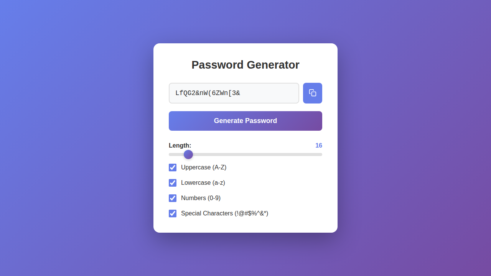

# Password Generator

A simple, secure password generator built with vanilla JavaScript.



## Features

- **Adjustable Length**: Use the slider to set password length from 3 to 128 characters
- **Character Options**: Toggle inclusion of:
    - Uppercase letters (A-Z)
    - Lowercase letters (a-z)
    - Numbers (0-9)
    - Special characters (!@#$%^&\* etc.)
- **Smart Checkbox Logic**: At least one character type must always be selected - the last remaining option is automatically disabled to prevent having zero options
- **One-Click Copy**: Copy generated passwords to clipboard instantly
- **Responsive Design**: Works on desktop and mobile devices
- **[NEW] Have I Been Pwned Integration**: Shows a warning if the generated password has been found in known data breaches

## Usage

1. Open `index.html` in your web browser
2. Adjust the password length using the slider
3. Select which character types to include using the checkboxes
4. Click "Generate Password" to create a new password
5. Click the copy button to copy the password to your clipboard

## Installation

No installation required! Simply clone or download this repository and open `index.html` in any modern web browser.

```bash
git clone https://github.com/ExXTreMe315/password-generator.git
cd password-generator
# Open index.html in your browser
```

## Files

- `index.html` - Main HTML structure
- `style.css` - Styling and responsive design
- `script.js` - Password generation logic and UI interactions

## Security Note

This password generator runs entirely in your browser. No passwords are sent to any server or stored anywhere. For maximum security, use this generator offline or host it on your own server.

Have I Been Pwned integration checks passwords against a public API to inform you if your generated password has been compromised in known data breaches. However, always use caution and consider generating passwords offline for sensitive accounts.
Have I Been Pwned API usage is subject to their terms and conditions.
Have I Been Pwned will also not store or log your generated passwords. The Generator uses a [k-anonymity](https://en.wikipedia.org/wiki/K-anonymity) model to check passwords without revealing the full password to the API.

## License

This project is licensed under the MIT License - see the [LICENSE](LICENSE) file for details.
